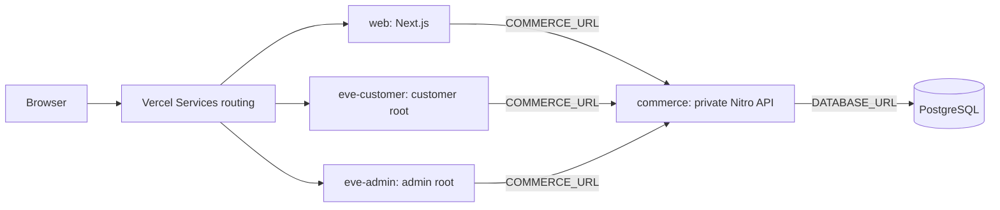

# Multi-agent services

This template combines a Next.js storefront, two Eve root agents, a private
Nitro commerce API, and PostgreSQL in one Vercel Services project. The agents
use an OpenAPI contract to discover commerce operations. Each root exposes a
different operation set and requires approval for writes.

> [!WARNING]
> This is a demonstration, not a production identity or commerce system. Any
> visitor can select the demo admin persona, make paid model requests, and
> change shared demo data. The UI displays model reasoning and raw tool data.
> Do not use real users, secrets, or commerce data.



## What the template shows

- `eve-customer` and `eve-admin` are separate top-level Eve agents. The
  browser addresses each agent directly. Neither agent delegates to the other.
- `packages/commerce-contract/openapi.yaml` is the source contract. Generated
  artifacts provide the tools that Eve exposes to each root.
- Vercel service bindings give `web` and both agents a private URL for
  `commerce`. Commerce still verifies a short-lived bearer token.
- AI Gateway uses Vercel OIDC. The two roots send separate reporting tags:
  `multi-agent-services:customer-agent` and
  `multi-agent-services:admin-agent`.

## Service map

| Service        | Source                | Public route                    | Role                                        |
| -------------- | --------------------- | ------------------------------- | ------------------------------------------- |
| `web`          | `apps/web`            | `/(.*)`                         | Storefront, demo session, and agent clients |
| `eve-customer` | `apps/customer-agent` | `/eve/agents/customer/eve/v1/*` | Catalog, current cart, and customer orders  |
| `eve-admin`    | `apps/admin-agent`    | `/eve/agents/admin/eve/v1/*`    | Products and inventory                      |
| `commerce`     | `apps/commerce`       | None                            | Private API and PostgreSQL access           |

## Run it locally

You need Node.js 24.x, pnpm 10.26.1, PostgreSQL, and a browser. The repository
includes the Vercel CLI as a pinned workspace dependency. Local setup does not
start PostgreSQL for you.

```bash
pnpm install
cp .env.example .env
```

Set `DATABASE_URL` and a random `DEMO_AUTH_SECRET` with at least 32 characters
in `.env`. Link the repository root to a Vercel project and pull its OIDC
environment before running model commands:

```bash
pnpm exec vercel link
pnpm exec vercel env pull
```

Do not set `AI_GATEWAY_API_KEY`. The agents reject that variable and use Vercel
OIDC instead.

Apply the migration and load the disposable demo data:

```bash
pnpm db:migrate
pnpm db:seed
```

The seed replaces the reference users, cart, orders, products, and inventory.
Use a disposable database.

Start the browser-facing local HTTPS proxy and the integrated Services flow:

```bash
pnpm portless:proxy
pnpm dev:services
```

Open the URL printed by Portless. The default main-worktree URL is
`https://multi-eve.localhost`. Run `pnpm portless:doctor` if the proxy or local
certificate is not ready.

Use `pnpm dev` for independent component work. That mode does not provide
Vercel rewrites or `COMMERCE_URL` bindings, so it cannot test commerce calls.

## Try the agents

1. Open `/` as the default customer persona.
2. Ask, `What is currently in my cart?`
3. Ask, `Set the Grid Felt Desk Mat quantity to 2.`
4. Approve the exact `setCartItemQuantity` request.
5. Select the admin persona and open `/admin`.
6. Ask, `Summarize low-stock variants.`
7. Ask, `Set the Fold Laptop Stand / Black on-hand quantity to 4.`
8. Approve the exact `setInventoryLevel` request.

The cart form sets the final quantity. It does not add to the existing quantity.
The app has no checkout or payment flow.

## Commands

| Command                                  | Purpose                                         |
| ---------------------------------------- | ----------------------------------------------- |
| `pnpm dev:services`                      | Run the four-service local topology             |
| `pnpm dev`                               | Run independent component hosts                 |
| `pnpm test`                              | Run deterministic Vitest suites                 |
| `pnpm lint`                              | Run configured workspace lint tasks             |
| `pnpm check-types`                       | Run TypeScript checks                           |
| `pnpm build`                             | Run configured workspace build tasks            |
| `pnpm openapi:check`                     | Check generated OpenAPI artifacts for drift     |
| `pnpm ai:costs`                          | Report current-month Gateway usage by agent tag |
| `pnpm ai:costs -- 2026-08-01 2026-08-08` | Report a UTC date range                         |

The cost report uses the AI Gateway Custom Reporting API. Reporting data can
take several minutes to appear. The API is account-wide and may charge for
report queries. The command is also available as
`npm run ai:costs -- 2026-08-01 2026-08-08`.

## Documentation

- [Documentation index](docs/README.md)
- [Get started locally](docs/getting-started.md)
- [Architecture and request flows](docs/architecture.md)
- [Eve root agents](docs/eve-root-agents.md)
- [OpenAPI connection](docs/openapi-connection.md)
- [Security and caveats](docs/security-and-caveats.md)
- [Deployment](docs/deployment.md)
- [Testing and evals](docs/testing-and-evals.md)
- [Extend the template](docs/extending.md)
- [Customize the template](docs/customizing.md)
- [Troubleshooting](docs/troubleshooting.md)
- [Stock photo sources](docs/stock-photo-credits.md)

The source code uses the MIT License. See [LICENSE](LICENSE) and
[third-party notices](THIRD-PARTY-NOTICES.md).
