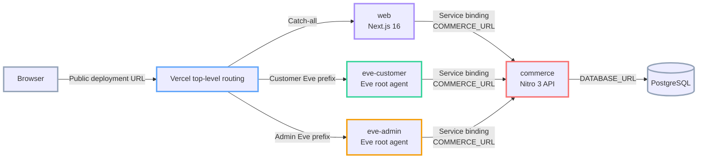
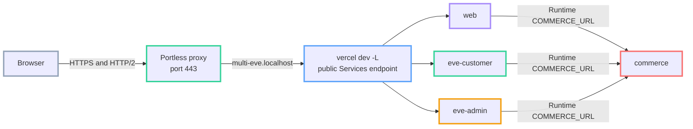
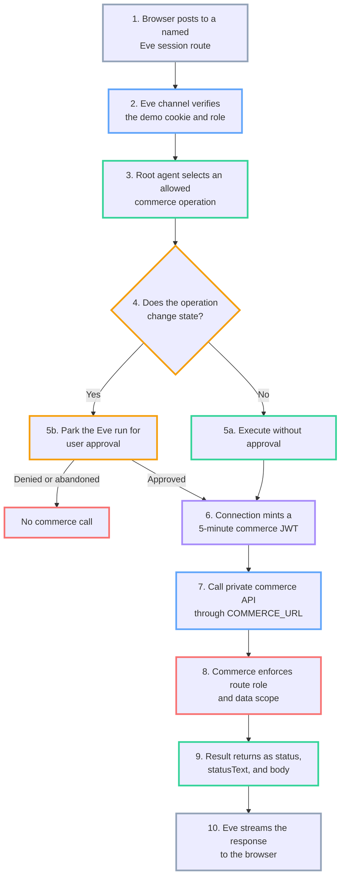

# Architecture and request flows

The repository separates public presentation, agent reasoning, commerce authorization, and data persistence into four Vercel services with one private API boundary.

## Service topology



| Service        | Runtime                 | Public ingress                  | Binding caller | Data ownership                                               |
| -------------- | ----------------------- | ------------------------------- | -------------- | ------------------------------------------------------------ |
| `web`          | Next.js 16              | `/(.*)`                         | Yes            | UI state and the signed demo persona cookie                  |
| `eve-customer` | Eve 0.29.5              | `/eve/agents/customer/eve/v1/*` | Yes            | Customer agent sessions, runs, and approval state            |
| `eve-admin`    | Eve 0.29.5              | `/eve/agents/admin/eve/v1/*`    | Yes            | Admin agent sessions, runs, and approval state               |
| `commerce`     | Nitro `3.0.260610-beta` | None                            | No             | Catalog, inventory, carts, orders, and all PostgreSQL access |

The `commerce` service is private because `vercel.json` defines no top-level rewrite to it. A Vercel service binding grants each caller internal reachability and injects `COMMERCE_URL` at runtime. The binding does not authenticate the caller, so commerce still verifies a bearer token on every data route.

## Local development topology

The default integrated flow keeps the deployment topology behind one browser-facing Portless endpoint:



Start the shared proxy with `pnpm portless:proxy`, then run `pnpm dev:services`. The latter uses `portless run --name multi-eve` to wrap `scripts/vercel-dev.mjs`, which maps Portless's `PORT` and `HOST` values into `vercel dev -L --listen`. The result is [https://multi-eve.localhost](https://multi-eve.localhost).

Every service entry in `vercel.json` uses `pnpm run dev:app` as its `devCommand`. These raw inner scripts start Next.js, Eve, or Nitro without Portless because the public Vercel CLI endpoint already has the outer Portless route. Calling a package's `dev` script from `devCommand` would create nested Portless processes.

Portless provides browser-facing local HTTPS, HTTP/2, and a trusted local certificate authority. Vercel CLI remains responsible for public rewrites and deployment-aware runtime service bindings. A local binding can therefore remain a loopback HTTP URL that Eve accepts even though the browser uses HTTPS. Preview verification is still required to prove that a deployed `COMMERCE_URL` uses HTTPS.

For component work, `pnpm dev` follows a different flow:

```text
pnpm dev -> Turbo -> package dev -> Portless -> package dev:app
```

The central `portless.json` assigns these hosts:

| Component        | Local URL                                                                    |
| ---------------- | ---------------------------------------------------------------------------- |
| `web`            | [https://multi-eve.localhost](https://multi-eve.localhost)                   |
| `customer-agent` | [https://customer.multi-eve.localhost](https://customer.multi-eve.localhost) |
| `admin-agent`    | [https://admin.multi-eve.localhost](https://admin.multi-eve.localhost)       |
| `commerce`       | [https://commerce.multi-eve.localhost](https://commerce.multi-eve.localhost) |

These hosts are independent processes. They do not include Vercel's named-agent rewrites or binding injection, and standalone agent hosts do not receive `COMMERCE_URL`. The local commerce host is browser-reachable through the loopback proxy for component debugging; that does not add public commerce ingress to a Vercel deployment.

`pnpm dev:services:raw` starts the same integrated Vercel Services topology without Portless. Use this raw HTTP endpoint only to isolate a Portless proxy or CA problem.

## Public routing

Vercel evaluates the top-level rewrites in order:

1. `/eve/agents/customer/eve/v1/(.*)` routes to `eve-customer`.
2. `/eve/agents/admin/eve/v1/(.*)` routes to `eve-admin`.
3. `/(.*)` routes every remaining request to `web`.

Each Eve service then applies a service-local `request.path` transform. For example, the public customer path `/eve/agents/customer/eve/v1/session` selects the internal Eve path `/eve/v1/session`. The build command sets `EVE_PUBLIC_ROUTE_PREFIX` to `/eve/agents/customer` or `/eve/agents/admin`, which lets Eve generate callback URLs with the public route prefix.

The web client uses `useEveAgent({ agent: "customer" })` and `useEveAgent({ agent: "admin" })`. Those identifiers map to the same named public prefixes. The browser remains on one origin, so it sends the demo session cookie with Eve requests without cross-origin resource sharing configuration.

## Storefront request flow

Server-rendered pages and Server Actions call commerce from the `web` service. Browser JavaScript never receives `COMMERCE_URL`, `DATABASE_URL`, `DEMO_AUTH_SECRET`, or a commerce bearer token.

```mermaid
flowchart LR
  A[1. Browser requests<br/>catalog, cart, or orders] --> B[2. web reads and verifies<br/>the demo session cookie]
  B --> C[3. web mints a 5-minute<br/>commerce access JWT]
  C --> D[4. Server-side fetch uses<br/>the COMMERCE_URL binding]
  D --> E[5. commerce verifies role,<br/>principal, and workspace]
  E --> F[6. Nitro service queries<br/>PostgreSQL through Drizzle]
  F --> G[7. Bounded JSON response<br/>returns to web]
  G --> H[8. Next.js renders or<br/>revalidates the UI]

  style A stroke:#94a3b8,stroke-width:3px
  style B stroke:#a78bfa,stroke-width:3px
  style C stroke:#a78bfa,stroke-width:3px
  style D stroke:#60a5fa,stroke-width:3px
  style E stroke:#f87171,stroke-width:3px
  style F stroke:#94a3b8,stroke-width:3px
  style G stroke:#34d399,stroke-width:3px
  style H stroke:#a78bfa,stroke-width:3px
```



Catalog calls use a `web` commerce principal. Cart and order calls require the active `customer` persona, while inventory calls require the active `admin` persona. Commerce scopes every query with the verified `workspaceId`; cart and order queries also use the verified customer `id`.

## Agent request and approval flow

The two Eve roots share the same shape but have different role checks, instructions, operation allowlists, and write approvals.



Customer reads are `listProducts`, `getProduct`, `getCurrentCart`, `listCurrentCustomerOrders`, and `getCurrentCustomerOrder`. Customer writes are limited to `setCartItemQuantity` and require `user-approval`.

Admin reads are `listProducts`, `getProduct`, and `listInventory`. Admin writes are limited to `updateProduct` and `setInventoryLevel`, and both require `user-approval`.

The approval gate confirms a specific tool input. It does not replace route authentication, commerce authorization, session ownership checks, or idempotency controls.

## Why commerce owns PostgreSQL

Only `apps/commerce/server/db/client.ts` imports the PostgreSQL client and reads `DATABASE_URL`. The web and Eve services import contract types and call HTTP operations instead of importing the schema or database client.

This boundary provides:

- One authorization layer for web and agent callers.
- One place to enforce workspace and customer scope.
- One canonical request and response contract.
- No database credentials or direct database code in browser-facing or model-facing apps.

The Vercel Services project may still expose project-level environment variables to multiple service runtimes. The current code only consumes `DATABASE_URL` in `commerce`; verify service-level secret isolation separately if your deployment requires it.

## Nitro routing on Vercel

`apps/commerce/nitro.config.ts` sets `serverDir: "./server"`. The standalone Nitro API handlers therefore live under `apps/commerce/server/routes/api`.

Use `server/routes/api` for Vercel. Nitro's provider documentation states that the shorthand Nitro `/api` directory is not compatible with Vercel for standalone usage. The route filename provides the HTTP method, such as `index.get.ts`, `[productId].patch.ts`, or `[variantId].put.ts`.

## Shared packages

| Package                   | Responsibility                                                                                            |
| ------------------------- | --------------------------------------------------------------------------------------------------------- |
| `@repo/commerce-contract` | Canonical OpenAPI source, generated JSON, generated TypeScript declarations, and runtime server injection |
| `@repo/demo-auth`         | Demo personas, session cookies, and short-lived commerce JWT creation and verification                    |
| `@repo/eslint-config`     | Shared lint configuration                                                                                 |
| `@repo/typescript-config` | Shared TypeScript configuration                                                                           |

Neither shared business package opens PostgreSQL. `@repo/demo-auth` signs and verifies tokens but does not decide route-level resource access; the consuming service performs that authorization.

## Failure boundaries

| Failure                 | Visible behavior                                                                              |
| ----------------------- | --------------------------------------------------------------------------------------------- |
| PostgreSQL unavailable  | `/api/health` returns `503` internally and commerce data calls fail with a sanitized response |
| `commerce` unreachable  | Web renders service error states; Eve receives a failed connection tool result                |
| Wrong demo role         | Web role gates the page; the target Eve channel returns `403`                                 |
| Write not approved      | Eve remains parked or records denial, and commerce receives no write request                  |
| Stale inventory version | Commerce returns `409 VERSION_MISMATCH`; the agent must re-read before retrying               |

There is no distributed transaction across services. Commerce writes use local PostgreSQL transactions where implemented, and clients must inspect each response before claiming success.

## Related documentation

- [Eve root agents](eve-root-agents.md)
- [OpenAPI connection](openapi-connection.md)
- [Security and caveats](security-and-caveats.md)
- [Portless](https://portless.sh)
- [Vercel Services routing](https://vercel.com/docs/services/routing)
- [Vercel service bindings](https://vercel.com/docs/services/bindings)
